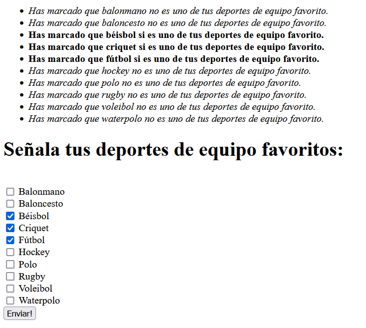

# Ejemplo de un formulario con checkbox

Imaginate que tienes que realizar una encuesta donde los usuarios tienen que marcar sus deportes de equipo favoritos. ¿Cómo recogerías todos esos datos?

Una de las soluciones es usar un formulario donde cada campo (en este caso cada checkbox) siga la siguiente estructura:
```html
<input type="checkbox" name="deportes[balonmano]" value='si' > Balonmano<br>
<input type="checkbox" name="deportes[baloncesto]" value='si' > Baloncesto<br>
<input type="checkbox" name="deportes[béisbol]" value='si' checked> Béisbol<br>
<input type="checkbox" name="deportes[criquet]" value='si' checked> Criquet<br>
<input type="checkbox" name="deportes[fútbol]" value='si' checked> Fútbol<br>
```
Fijate que cada `name=` tiene la forma `deportes[...]`. Esta estructura permite recibir los datos de forma estructurada en el array `$_POST`:

```php
$_POST['deportes']['balonmano']
$_POST['deportes']['baloncesto']
$_POST['deportes']['béisbol']
...
```
El problema es que **si no se marca un checkbox (por ejemplo: `deportes[fútbol]`) no aparecerá en el array `$_POST` la entrada correspondiente del array (que sería `$_POST['deportes']['fútbol']`)**. Esto crea problemas, porque hay que checkear múltiples veces con `isset` o `array_key_exists` si un campo existe o si no. 

En este ejemplo se ve una solución a ese problema. Pero antes de entrar en el ejemplo, veamos de que se trata. En este ejemplo se pide al usuario que marque sus deportes de equipo favoritos de una lista de deportes y luego, simplemente, se muestra aquellos casillas que se han marcado y aquellas que no se han marcado:



Para realizar este ejercicio se utilizan varias estrategias que te resultarán de interés:

* Almacenar en un array los valores "por defecto" para cada opción.
* Filtrar los datos recibidos, para desechar campos recibidos fruto de la alteración malientencionada del formulario (usamos `array_intersect_key`).
* Filtrar los valores recibidos, para desechar campos cuyo valor recibido no sea uno concreto, evitando nuevamente alteranciones malintenciandas del formulario (usamos `array_filter`).
* Combinar los datos recibidos, con los valores por defecto, para así completar el array con los checks no marcados (usamos `array_merge`).

Échale un vistazo y verás como el tratamiento de este tipo de formularios se simplifica.

