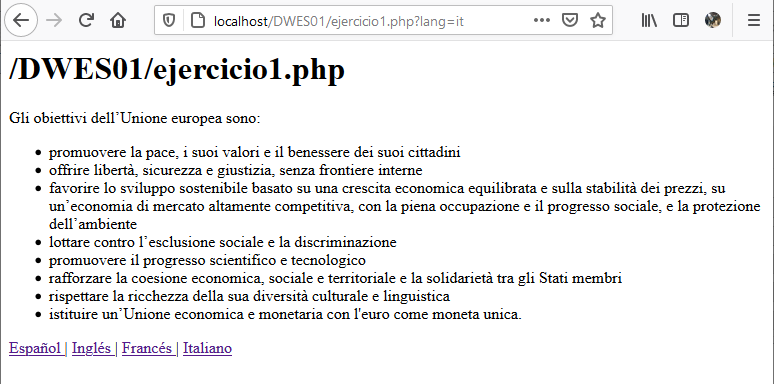

# Ejercicio 1: objetivo de la unión europea

En este primer ejercicio tendrás que hacer un script PHP que muestre los objetivos de la unión europea en un dioma concreto (inglés, francés, español o italiano), en función del valor de un parámetro (`lang`) recibido vía GET.

El objetivo de este primer ejercicio es:

>Manejar dos funciones clave de PHP: include e include_once.
>Entender como recibe un script PHP los parámetros vía GET.
>Hacer un procesamento básico de los parámetros recibidos vía GET.

La idea es que al teclear las URL siguientes, aparezca una traducción u otra:

* http://localhost/DWES01/ejercicio1.php?lang=es se mostrarán los objetivos de la unión europea en español (puedes copiarlos de https://europa.eu/european-union/about-eu/eu-in-brief_es).
* http://localhost/DWES01/ejercicio1.php?lang=it se mostrarán los objetivos de la unión europea en italiano (puedes copiarlos de https://europa.eu/european-union/about-eu/eu-in-brief_it).
* http://localhost/DWES01/ejercicio1.php?lang=fr se mostrarán los objetivos de la unión europea en francés (puedes copiarlos de https://europa.eu/european-union/about-eu/eu-in-brief_fr).
* http://localhost/DWES01/ejercicio1.php?lang=en se mostrarán los objetivos de la unión europea en inglés (puedes copiarlos de https://europa.eu/european-union/about-eu/eu-in-brief_en).

A la hora de realizar este ejercicio tienes que tener en cuenta:

* Las diferentes traducciones se almacenarán en archivos separados en la carpeta `translations` dentro de la carpeta de proyecto DWES01:
    * `translations/ejercicio1.trans.en.html` contendrá la traducción al inglés,
    * `translations/ejercicio1.trans.es.html` contendrá la traducción al español,
    * `translations/ejercicio1.trans.it.html` contendrá la traducción al italiano
    *  y `translations/ejercicio1.trans.fr.html` contendrá la traducción al francés.
* Existirá un archivo de configuración llamado `ejercicio1_config.inc.php` que contendrá un array asociativo de PHP (es decir, un array tipo llave-valor) para almacenar el archivo de traducción que corresponde a cada idioma. Por ejemplo, para el francés contendría la pareja llave-valor siguiente: `"fr" => "ejercicio1.trans.fr.html";` y así sucesivamente.
* En el archivo principal, llamado `ejercicio1.php`, se cargará solo una vez al principio el archivo `ejercicio1_config.inc.php`. Además, se usará el array asociativo creado en dicho archivo de configuración para determinar el archivo html con la traducción a cargar, y para cargar el archivo en cuestión se usará la función `include`.
* Si el parámetro `lang` no está presente o indica un idioma distinto de los disponibles, se mostrará el texto en inglés.
* Existirá un archivo llamado `ejercicio1.trans.foot.html`, en la carpeta `translations`, que contendrá los enlaces de las cuatro traducciones. Este archivo deberá cargarse por el script `ejercicio1.php` usando la función `readfile`.

El aspecto final del ejercicio 1 debe ser similar al siguiente (aunque puedes mejorarlo). Fíjate que al principio del archivo se muestre el nombre del script, usa el array `$_SERVER` para obtener dicha información:

¡¡Importante!! Todos los archivos del ejercicio 1 deben estar dentro de la carpeta de proyecto DWES01, junto con el resto de ejercicios, de forma que la URL sea del siguiente estilo:

`http://localhost/DWES01/ejercicio1.php?lang=it`
