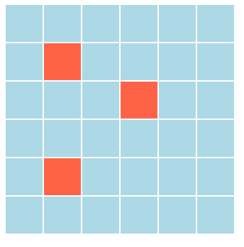

# Tres línea

En este ejercicio se crea un algoritmo que, usando sesiones, detecta tres pulsaciones en línea dentro de una cuadrícula como la mostrada en la siguiente imagen.

Cada vez que se haga clic en una casilla esta se marcará en rojo. Cuando se detecten tres casillas en rojo consecutivas la matriz se volverá a resetear a azul. 

Este algoritmo tiene 4 niveles de logro de dificultad incremental.

## Nivel 1 

- Se usarán sesiones para almacenar un array bidimensional 6x6.
- Este array bidimensional se mostrará como una tabla HTML (6 filas x 6 columnas).
- El array bidimensional contendrá "el color" (o información que simboliza al color) que se representará para cada casilla de la tabla.
- Inicialmente el array bidimensional tendrá el mismo "color" para todas las casillas (azul), y al hacer clic en alguna casilla, esta cambiará de color (rojo). Nota: no se usa Javascript, como es obvio.
- Las casillas que se van cambiando de color se almacenan en la sesión, de forma que cada clic aumentará el número de casillas con color diferente (rojo).

## Nivel 2

Una vez que tengas lo anterior:

- Tras hacer clic en una casilla, deberás comprobar si esa casilla conforma 3 en fila con las que tiene a su alrededor en las 8 direcciones posibles.

## Nivel 3

Y una vez que tengas lo anterior:

- Tras hacer clic en una casilla, deberás comprobar si esa casilla está en medio de otras 3 que están en fila. 

## Nivel 4

Y por último, adapta el algoritmo para poder usar diferentes dimensiones de tabla (5x5, 7x10, etc.) configurandolo con constantes, y con diferentes tamaños de línea (3 en raya, 4 en raya, etc.)

 
