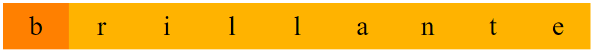
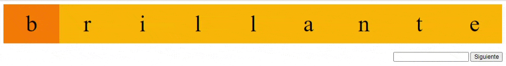

# Ejercicio resuelto: Un texto brillante

En este ejercicio deberás elaborar un script llamado `ejercicio2.php` donde usarás las cookies para hacer un efecto de texto (importante: no se puede usar JavaScript para simular este efecto). Cada vez que se invoque el script `ejercicio2.php` se resaltará un carácter diferente de una cadena de texto mostrada. Por ejemplo, en una primera invocación se resaltará el primer caracter:

La segunda vez que se invoca este script, se resaltará el siguiente caracter:

Así sucesivamente hasta llegar al último caracter, momento en el cual se comenzará desde el principio. La página se recargará automáticamente cada 5 segundos, de forma que el caracter irá cambiando:

Para recargar la página automáticamente puedes usar la siguiente etiqueta meta:  <meta http-equiv="refresh" content="5">

Además, en la página web abrá un pequeño formulario para poder cambiar la palabra a mostrar, a través de una caja de texto junto a un botón nombrado como "Siguiente". El funcionamiento será tal y como se describe a continuación:

* Si se indica un texto en la entrada de texto y se hace clic en el botón "Siguiente", se cambiará el texto mostrado, comenzando a resaltar la primera letra del texto. Ten en cuenta que el texto a mostrar se cambiará solo si la longitud del mismo está entre 4 y 10 carácteres. En caso contrario debe mostrar una palabra por defecto a tu elección (brillante, por ejemplo).
* Si no se indica ningún texto en la caja, al pulsar "Siguiente" simplemente se procederá a marcar el siguiente caracter de la palabra sin esperar a que la página se recarge automáticamente.

Para realizar este ejercicio tendrás que usar cookies obligatoriamente, dos para ser exactos:

* Cookie `vart`. En esta cookie se almacenara un array serializado con la siguiente información:
    - texto que se muestra.
    - posición del texto resaltada.
    - un número aleatorio mayor de 999999 (que se cambiará en cada consulta).
    - marca de tiempo (generada con el método time()).
* Cookie `verf`. Esta cookie contiene un resumen hash sha256 del contenido de la cookie `vart`. El objetivo es verificar que la cookie `vart` no ha sido manipulada en el lado del cliente, por lo que antes de proceder a usar los datos de la cookie `vart` debes realizar las comprobaciones oportunas para comprobar que dicha cookie no ha sido modificada.

El objetivo del número aleatorio y la marca de tiempo en la cookie `vart` es garantizar que cada vez que se consulta el script `ejercicio2.php` se genera un resumen hash sha256 diferente y no reutilizable en la cookie `verf`.
