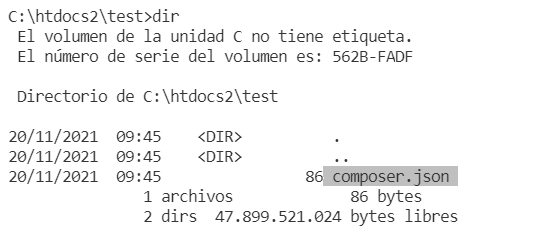

# Instalación y uso básico de `composer`

[`composer`](http://getcomposer.org) es un gestor de dependencias para php. Esta herramienta permite crear proyectos que reutilicen código (en forma de librerías y paquetes) ya existentes previamente. 

## Instalación

`composer` en si mismo es un programa escrito en php que se ejecuta en la línea de comandos. Para instalarlo lo mejor es que vayas a la documentación oficial y sigas las instrucciones de instalación: [instalación de composer](https://getcomposer.org/doc/00-intro.md).

## Uso inicial.

Un proyecto que usa `composer` (o que quiere usar `composer`) comienza con la creación de un archivo `composer.json` en la raíz de la carpeta del proyecto:

 

En el ejemplo anterior, la carpeta de nuestro proyecto php es `C:\htdocs2\test`.

> _**Importante**: Si no conoces la sintáxis de JSON es el momento de que le eches un vistazo, realmente es muy sencillo: [sintáxis JSON](https://www.w3schools.com/js/js_json_syntax.asp)._

## Estructura del archivo JSON

La estructura inicial del archivo JSON la podemos crear directamente ejecutando el comando:

```
composer init
```

Esto iniciará una interfaz donde se irán pidiendo diferentes datos de forma iterativa:

- Nombre del paquete (package name).
- Descripción (opcional)
- Autor (opcional)
- Estabilidad mínima (opcional)
- Tipo de paquete (en nuestro caso, será tipo "project")
- Licencia
- Dependencias

Esto generará un archivo json llamado `composer.json` como el siguiente:

```json
{
    "name": "salvadorromerovillegas/miprojecto",
    "description": "Ejemplo de descripcion",
    "type": "project",
    "require": {
        "smarty/smarty": "^4.0"
    }
}
```
En el ejemplo anterior nuestro proyecto depende de smarty.

## Estructura de proyecto

Una vez ejecutado `composer init` se generará una estructura de proyecto como la siguiente:

```
C:\htdoc2\test\
   composer.json
   composer.lock
   \vendor
        \autoload.php

```
Se creará un archivo .json y un archivo .lock para gestionar las dependencias. 

También habrá una carpeta llamada `vendor` que contendrá el código del que nuestra aplicación depende (smarty por ejemplo). 

Además, en la carpeta `vendor` habrá un archivo importante, el archivo `autoload.php`, que se usará para cargar las dependencias en nuestros scripts.

## Añadir una dependencia

Si tenemos un proyecto y queremos añadir una dependencia podemos usar el comando siguiente:

```
composer require psr/log
```
En el caso anterior, 'psr/log' es el paquete del que depende nuestro proyecto.

También podemos añadir `"psr/log": "^1.1"` directamente al archivo `composer.json`, dentro de la sección `require`:

```json
    "require": {
        "smarty/smarty": "^4.0",
        "psr/log": "^1.1"
    }
```
Si lo hacemos manualmente debemos luego ejecutar `composer update` para que resuelva las dependencias e instale el paquete.

Lo mismo ocurre si quitamos una dependencia borrandola del archivo json directamente, luego hay que ejecutar de nuevo `composer update`.

No obstante, si queremos quitar una dependencia también podemos usar lo siguiente:

```
composer remove psr/log
```

## Usando las dependencias

Para empezar a usar los archivos de los que depende nuestro proyecto debemos incorporar con require o require_once el archivo autoload.php. La forma típica es así:

```php
<?php

require_once __DIR__ . '/vendor/autoload.php';

```

A partir de ese momento las clases y funciones de los paquetes que hemos importado a través de composer están disponibles. Por ejemplo, para el caso de Smarty sería así:

```php
<?php

require_once __DIR__ . '/vendor/autoload.php';

$smarty = new Smarty();
```

El caso anterior expone el código de un script php situado en la carpeta raíz del proyecto, por ejemplo: `/path/to/project/index.php`

```
C:\htdoc2\test\
   index.php
   composer.json
   composer.lock
   \vendor
        \autoload.php
```

## Añadiendo nuestras propias clases al autoloading

Si queremos, podemos usar nuestras propias clases con el autoloading, pero lo suyo es usar espacios de nombres (namespaces). Lo primero sería prever un directorio donde vamos a poner nuestro esquema de clases, por ejemplo, el directorio `src`:

```
C:\htdoc2\test\
   index.php
   composer.json
   composer.lock
   \src
        \Ejemplo.php
   \vendor
        \autoload.php

```

Las clases vamos aponer dentro de la carpeta `src` estarán en el espacio de nombres `DWES04`. Para que el autoloading se pueda realizar (PSR-4), debemos poner el mismo nombre de archivo (`Ejemplo.php`) que el nombre de la clase (`class Ejemplo`). Veamos un ejemplo de todo junto:

```php
<?php
namespace DWES04; /* Indicamos que la clase Ejemplo está en el espacio de nombres DWES04 */

class Ejemplo {

    static public function test()
    {
        echo "test";
    }

}
```

Después, modificamos el archivo `composer.json` para indicar que se haga autoloading de la carpeta `src` y que dentro de dicha carpeta están los paquetes del espacio de nombres `DWES04`:

    "autoload": {
        "psr-4": {"DWES04\\": "src/"}
    }

Antes de hacer uso de nuestra clase Ejemplo, debemos de hacer un `composer update`, simplemente para que actualice el archivo `/vendor/autoload.php`.

Después, ya podemos hacer uso de nuestra clase sin tener que hacer "require" para cada "php":

```php
<?php
require_once __DIR__ . '/vendor/autoload.php';
$smarty = new Smarty();
DWES04\Ejemplo::test();
```
> _**Importante**:  para hacer referencia a las clases que tenemos dentro de nuestra carpeta `src` habrá que hacer referencia al `namespace` donde está o hacer uso de `use`:_
>```php
>use DWES04\Ejemplo;
>Ejemplo::test();
>```
>_Para más información consulta la guía de namespaces de php._

## Si quiero enviar el proyecto al profesorado o subirlo a github...

Una vez que has finalizado el proyecto usando composer, las carpetas `vendor` y el archivo `composer.lock` son solo necesarios en producción. En realidad, la información contenida en `composer.json` es la que se necesita para volver a instalar las dependencias y usar tu proyecto. 

De hecho, si borras la carpeta `vendor` y el archivo `composer.lock` puedes volver a instalar todas las dependencias haciendo:

```
composer install
```

Así que no olvides borrar lo innecesario antes de enviar el proyecto a otra persona (cuidado de no borrar otras cosas que si son de tu propio código).